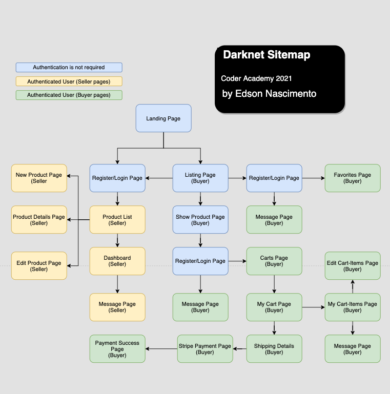
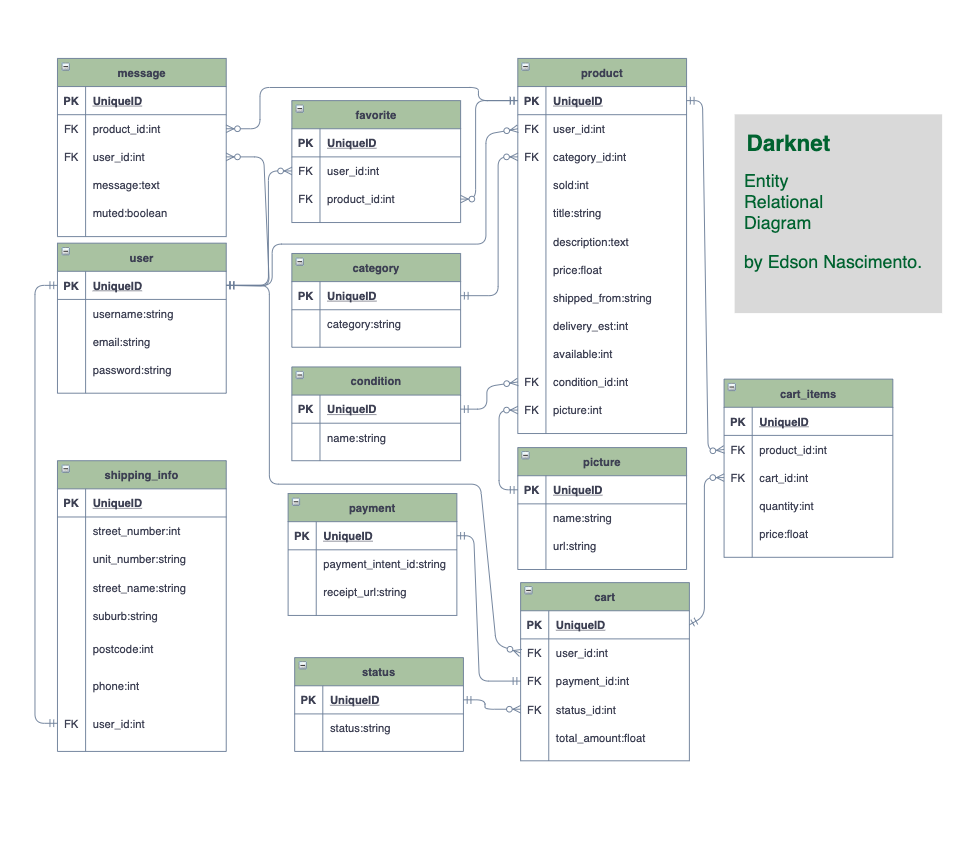

# README

## Table of Contents: 

[Links](#links)  
[Setup Instructions & Logins](#setup)  
[Problem](#problem)   
[App Overview](#overview)  
[User Stories](#userstories)  
[Target Audience](#targetaudience)   
[Tech Stack](#techstack)   
[Planning & Project Management](#projectmgnt)   
[Wireframes & Sitemap](#wireframes)  
[schema](#schema)   
[Entity Relationships](#relations)  
[Third Party Services](#thirdparty)  

--- 

## R7	Identification of the problem you are trying to solve by building this particular marketplace app.

## R8	Why is it a problem that needs solving?

## R9 Visit Darknet website at:	https://darknet2.herokuapp.com/  

## R10	Visit GitHub repository (repo) at https://github.com/Kryptic2020/darknet  

  

## R11	Darknet app description:  

 ### Purpose
   Darnet aim to reach a global e-commerce scale, connecting millions of buyers and sellers from all markets. Darknet provides economic opportunity to every individuals with no exception, it includes entrepreneurs, businesses and organizations, does not matter how big or small size they are.
 ### Functionality / features:
 - Local authentication  - Register, Login, Forgot password and Update password.
 - View listing - Search and filtering by categories, price ascending and descending, name ascending and descending.
 - Message Seller.  
 - View product details.  
 - Add prodcut to or remove from favorite list.  
 - View favorite list.  
 - Add product to a cart.  
 - View carts, view cart, view cart-items.  
 - Delete or update cart, delete or update cart-items.  
 - Add or edit shipping information.  
 - Process a cart payment using credit card with stripe.  
 - Access any current and previous carts and its details such as receipt, quantity, amount, title, description and much more.  
 - Receive a sign up welcome email.  
 - Receive a payment receipt by email.  
 - Add or remove a selling product.  
 - See a list of your selling products.  
 - See and update your selling products.  
 - See a dashboard with performance of your selling products, such as total revenue, total sold, total available.  
 - See an inbox of queries for your products from potential or current buyers, only unanswered client will be listed on your inbox.  
 - Message back your clients.   

  - 
 ## Sitemap 
 
 
 ## Landing Page  
   
 ## Listing Page  
     
   
 ## Show Product Page  
   
   
 ## Carts Page  
   
 ## Cart Page  
   
 ## Cart-Items Page  
   
 ## Message Seller Page  
   
 ## Favorites Page  
   
 ## Shipping Page  
   
 ## Payment Page  
   
 ## Payment Confirmation Page  
   
 ## Receipt Page  
   
 ## Selling List Page  
   
 ## Selling Product Page  
 
   
 ## Dashboard Page  
   
 ## Replying Page  
   

 ### Target audience
  - For any entrepreneurs, businesses and organizations to buy or sell products and services in general. 
 ### Tech Stack

- HTML: front end content
- Bootstrap SASS Framework: front end design 
- JavaScript: front end toggle functions, submit and instant message refresher, event listener for stripe. 
- Ruby on Rails: front end erb embedded code and back end functional code.
- Postgres Database: relational database model.
- Heroku: deployment platform.
- Sendgrid: Email API smtp.
- Stripe: Payment Gatway API.
- AWS S3: Cloud storage for images.
- Git version control: 16 branches and more than 50 commits.

## R12	User stories for your app  

# User Stories

### ***As a Guest***
- I want to view listings, search for specific plants, and view sellers' profiles.
- I want to sign up securely and become a member of Marketplants to buy or sell plants.

### ***As a Seller***
- I want to create listings and provide details such as multiple photos, description, category, location with local maps, price, ect.
- I want to edit my listings, such as changing price or uploading new photos.
- I want to delete any of my listings.
- I want to create and display my personal profile (name, location and photo) and active listings for potential buyers.
- I want to receive payment by using a secure and cashless platform.

### ***As a Buyer***
- I want to search for certain plants by using keywords.
- I want to see the details of the plant including photos, description, category and price.
- I want to see the plant's location and a local map to determine if the plant is easy for me to pick up.
- I want to see the sellers' profiles and their locations and active listings.
- I want make payments securely and see the receipts of my purchases.

R13	Wireframes for your app  

# R14	Darknet ERD's Design    
### Initial Version  
* The initial ERD version during the initial development stages, bank details, address and location was considered for all users, but after taking user experience into consideration and time optimization, I decided to go for a more dry solution, replacing those tables with a shipping info table, so before each payment on the wesite the user will be required to provide, confirm or update shipping info. Comparing with the initial design, those changes is far benefitial for this project. The initial version can be found below:  
   
### Final Version  
* In the advanced stages of the development, I identified that the project could have 2 more features and those features could easily implemented and linked to some existing tables, and realised that approach would not risk or cause any harm to the actual code. Then two join tables were added to support Favorites and instant Messaging features. The final result of those implementations can be found below, at the final ERD version:  
 

R15	Explain the different high-level components (abstractions) in your app

R16	Detail any third party services that your app will use

# R17	Model Relations   

## **User : Product**  
This relationship shows a user can have many products and a product belongs to a user. The relationship is created by referencing the user_id in the product model to represent a one-to-many association. I also used "has_one_attached" within the Product model. This allows the product to be saved with an image. 

## **User : Cart**  
This relationship shows a user can have many carts and a cart belongs to a user. The relationship is created by referencing the user_id in the cart model to represent a one-to-many association. 

## **User : Shipping_info**  
This relationship shows a user can have only one shipping_info and a shipping_info belongs to a user. The relationship is created by referencing the user_id in the Shipping_info model to represent a one-to-one association. 

## **Payment : Cart**  
This relationship shows a payment can have only one cart and a cart belongs to a payment. The relationship is created by referencing the payment_id in the Cart model to represent a one-to-one association. 

## **Status : Cart**  
This relationship shows a status can have only one cart and a cart belongs to a status. The relationship is created by referencing the status_id in the Cart model to represent a one-to-one association. 

## **Category : Product**    
This relationship shows a category can have many products and a product belongs to a category. The relationship is created by referencing the category_id in the Product model to represent a one-to-many association. 

## **Conditon : Product**    
This relationship shows a condition can have many products and a product belongs to a condition. The relationship is created by referencing the condition_id in the Product model to represent a one-to-many association. 

## **Picture : Product**    
This relationship shows a picture can have many products and a product belongs to a picture. The relationship is created by referencing the picture_id in the Product model to represent a one-to-many association. 

## **Product : Cart : Cart_Items**    
This relationship shows a product can have many carts through cart_items join table and a cart can have many products through cart_items join table. The cart_items join table belongs to product table and also belongs to cart table. The relationship is created by referencing the product_id and cart_id in the Cart_Items model to represent a many-to-many association. 

## **Product : User : Favorite**  
This relationship shows a product can have many users through favorite join table and a user can have many products through favorite join table. The favorite join table belongs to product table and also belongs to user table. The relationship is created by referencing the product_id and user_id in the Favorite model to represent a many-to-many association. 

## **Product : User : Message**    
This relationship shows a product can have many users through message join table and a user can have many products through message join table. The message join table belongs to product table and also belongs to user table. The relationship is created by referencing the product_id and user_id in the Message model to represent a many-to-many association.  

# R18	Discuss the database relations to be implemented in your application  

  

# R19	Database schema design
''' ruby

  Table "picture"{  
    pk "id"  
    string "name"  
    string "url"  
    fk "product_id"  
  }

  Table "cart_items"{  
    pk "id"  
    integer "quantity"  
    float "price"  
    fk "product_id"  
    fk "cart_id"  
  }

  Table "cart"{  
    pk "id"  
    float "total_amount"  
    fk "user_id"  
    fk "status_id"  
    fk "payment_id"   
  }

  Table "category"{  
    pk "id"  
    string "name"  
  }

  Table "condition"{  
    pk "id"  
    string "name"  
  }

  Table "favorite"{  
    pk "id"  
    fk "user_id"  
    fk "product_id"  
  }

  Table "message"{  
    pk "id"  
    fk "user_id"  
    fk "product_id"  
    text "message"  
    boolean "muted"  
  }

  Table "payment"{  
    pk "id"  
    string "payment_intent_id"  
    string "receipt_url"  
  }

  Table "product"{  
    pk "id"  
    string "title"  
    text "description"  
    float "price"  
    string "shipped_from"  
    integer "delivery_estimated"  
    integer "quantity_available"  
    integer "sold"  
    fk "user_id"  
    fk "category_id"  
    fk "condition_id"  
  }

  Table "shipping_info"{  
    pk "id"  
    integer "street_number"  
    string "unit"  
    string "street_name"  
    string "suburb"  
    integer "phone"  
    integer "postcode"  
    fk "user_id"  
  }

  Table "status"{  
    pk "id"  
    string "name"  
  }

  Table "user" {  
    pk "id"  
    string "username"  
    string "email"  
    string "password"  
  } 
  

'''

# R20	Describe the way tasks are allocated and tracked in your project

