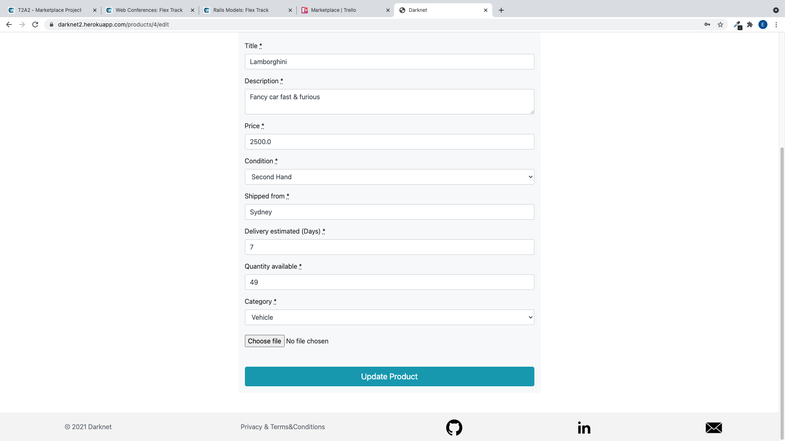
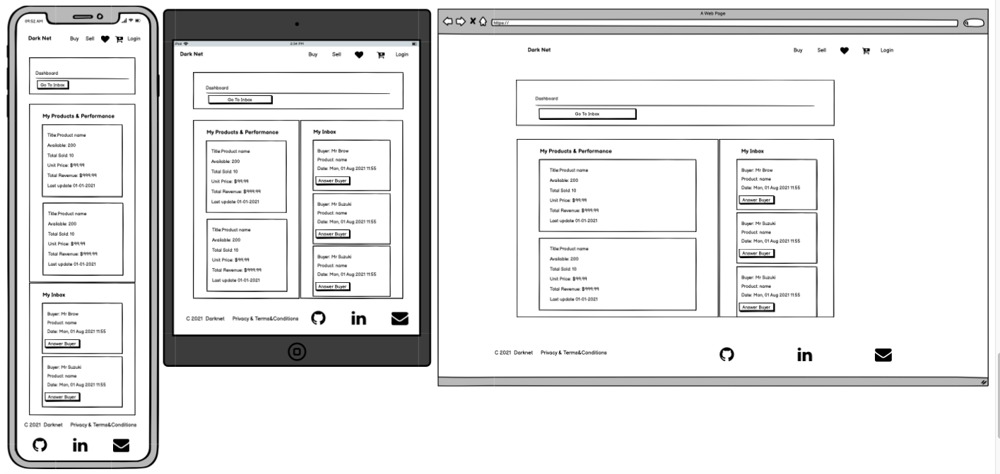

# README


## Table of Contents: 

[Setup Instructions & Logins](#setup)  
[Problem](#problem)
[Solution](#solution)
[Links](#links)  
[App Overview](#overview)  
[User Stories](#userstories) 
[Wireframes](#wireframes)  
[ERD](#erd)   
[High Level Components](#abstractions)  
[Third Party Services](#thirdparty)   
[Gems](#gems)  
[Models Associations](#associations)   
[Entity Relations](#relations)   
[Schema](#schema)  
[Planning & Execution - Project Management](#trello)    

<a name="setup"/></a>
## Setup Instructions (Local)

- Clone this repo
- ``` bundle install ``` to install all required dependencies
-  ``` rake db:setup ``` to create local database, migrate all migrations and seed database.
- Enter credentials for Sendgrid & Stripe API's. 
- ```rails server``` to run the rails server
- Load http://localhost:3000/ in the browser    

<a name="problem"/></a> 

# Marketplaces Problems.
With the recent online shopping boom due to the pandemic, I decided to do a research and see if I could capture any opportunity for business that somehow gives me the power to contribute to our global society.  
After researching the markets, the sector for brand new and second-hand products had my attention due to its high level of complaints. After digging deeper into that I found out most of the complaints come from bad buyer’s and seller’s experience.
The most common complaints were:  

* Too many restrictions for sellers.
* Complex process to get approved as a seller.
* Complex process to get a product approved and posted.
* Complex process to update or remove a selling product.
* No high-quality product image.
* High subscription fees
* Expensive commission fees
* No support on disputes
* Too many adds, and intrusive marketing campaign
* No easy channel to contact seller
* No clear information about shipping location
* No clear information about shipping timeframe
* No safe payment method
* No clear confirmation about payment
* No favourite list
* No descriptions
* Monopoly!

<a name="solution"/></a>

# Marketplace Solution  
Darknet was developed not to only try solving most of the above-mentioned issues and been an inclusive platform for bad experience Sellers and Buyers, but also to contribute to the global economy.  
Our platform will help individuals, entrepreneurs and business, to sell more products, make more income, pay more taxes, resulting in more investment and development in areas such as health, education and technology for our global society.


<a name="problem"/></a>

# Visit Darknet website at:  	
### https://darknet2.herokuapp.com/  


# Visit GitHub repository (repo) at:  
### https://github.com/Kryptic2020/darknet  


<a name="overview"/></a>  

# Darknet App Overview:    

 ### Purpose
   Darknet aim to reach a global e-commerce scale, connecting millions of buyers and sellers from all markets. Darknet provides economic opportunity to every individuals with no exception, it includes entrepreneurs, businesses and organizations, does not matter how big or small size they are.
 ### Functionality / features:
 - Local authentication  - Register, Login, Forgot password and Update password.
 - View listing - Search and filtering by categories, price ascending and descending, name ascending and descending.
 - Message Seller.  
 - View product details.  
 - Add prodcut to or remove from favorite list.  
 - View favorite list.  
 - Add product to a cart.  
 - View carts, view cart, view cart-items.  
 - Delete or update cart, delete or update cart-items.  
 - Add or edit shipping information.  
 - Process a cart payment using credit card with stripe.  
 - Access any current and previous carts and its details such as receipt, quantity, amount, title, description and much more.  
 - Receive a sign up welcome email.  
 - Receive a payment receipt by email.  
 - Add or remove a selling product.  
 - See a list of your selling products.  
 - See and update your selling products.  
 - See a dashboard with performance of your selling products, such as total revenue, total sold, total available.  
 - See an inbox of queries for your products from potential or current buyers, only unanswered client will be listed on your inbox.  
 - Message back your clients.   
  
 ## Sitemap 
 
 
 ## Landing Page  
     
 ## Listing Page  
       
     
 ## Show Product Page  
     
   
 ## Carts Page  
     
 ## Cart Page  
     
 ## Cart-Items Page  
     
 ## Edit Cart-Items Page  
 
     
 ## Ask Seller Page  
     
 ## Favorites Page  
   
 ## New Shipping Page  
       
 ## Shipping Page  
  
 ## Edit Shipping Page  
        
 ## Payment Page  
     
 ## Payment Confirmation Page  
     
 ## Receipt Page  
     
 ## Selling List Page  
    
 ## New Selling Product Page  
 
        
 ## Selling Product Page  
 
   
 ## Edit Selling Product Page  
 
       
 ## Dashboard Page  
     
 ## Replying Client Page  
     
 ## Email Welcome  
     
 ## Email Receipt  
     

 ### Target audience
  - For any individual, entrepreneurs, businesses and organizations to buy or sell brand new and second hand products literally in general, anything!    

 ### Tech Stack
- HTML: front end content
- Bootstrap SASS Framework: front end design 
- JavaScript: front end toggle functions, submit and instant message refresher, event listener for stripe. 
- Ruby on Rails: front end erb embedded code and back end functional code.
- Postgres Database: relational database model.
- Heroku: deployment platform.
- Sendgrid: Email API smtp.
- Stripe: Payment Gatway API.
- AWS S3: Cloud storage for images.
- Git version control: 16 branches and more than 50 commits.  

<a name="userstories"/></a>

# User stories  

### ***As a Visitor***
- I want to view listings with nice image and details.
- I want to search for specific products using partial words, filtering by categories, prices and product names.

### ***As a Seller***
- I want to create listings with product details such as photo, description, category, Shipping location, shipping time frame, quantity available, quantity sold and price.
- I want to edit my listings as much as needed, having fully access to edit all the details or even  uploading a photo.
- I want to delete any of my listings.
- I want to receive online payment only, and receive my money daily basis with a safe plataform.
- I want to the perfomance of my sales, also control of my sold and available stock.
- I want to receive queries from my clients by a sort of messaging system.

### ***As a Buyer***
- I want to search for specific products using partial words, filtering by categories, prices and product names.
- I want to message the seller for informations about the product.
- I want to add to or remove products from favorites list/wish list.
- I want to add to, update or remove products from a cart.
- I want to see where the product is shipped from and time frame for delivery.
- I want make payments oline payment and receive receipts of my purchases by email.
- I want to see my previous purchases and access its receipts.

<a name="wireframes"/></a>

# Wireframes 

### Landing Page  
   

### Listings Page  
  

### Product Page  
  

### All Carts Page  
  

### MyCart Page  
  

### Dashboard Page  
  

<a name="erd"/></a>

# ERD    
### Initial Version  
* The initial ERD version during the initial development stages, bank details, address and location was considered for all users.
* After taking user experience into consideration and time optimization, I decided to go for a more dry solution, replacing those tables with a shipping info table, so before each payment on the wesite the user will be required to provide, confirm or update shipping info. Comparing with the initial design, those changes is far benefitial for this project. 
* The initial version can be found below:  
   
### Final Version  
* In the advanced stages of the development, I identified that the project could have 2 more features and those features could easily implemented and linked to some existing tables, and realised that approach would not risk or cause any harm to the actual code.   
Then two join tables were added to support Favorites and instant Messaging features.   
* To support the implementation of AWS S3 cloud storage, Active_storage_blobs and Active_storage_Attachments were also included.
* The final result of those implementations can be found below, at the final ERD version:  
 

<a name="abstractions"/></a> 

# High-level components  

**1. Action Controller**  

Darknet uses rails arquitecture and benefit from the use of Action Controller, or "Controllers. Controllers's methods also called actions are linked to the routing, that means each Http request hits an action on the controllers. The controller receive a request and handle views and models. For instance an user try to open a webpage, an HTTP request is sent, an action in the controller's classes and methods is actioned, the controller fetch data with the help of the models, in which manage relations and crud operations, and then the controller send its data to the views (html file embeded on Ruby as (ERB) files, making the magic of allowing embeded ruby code on it) to be rendered back to the browser. Code example:
```ruby

  # Send @Categories and @Products to HTML,  - listing GET  /listing
  def listing    
    @categories = Category.all 
    # Fetching Products with eagle loading, method search at product model       
    @products = Product.search(params[:search],params[:category],params[:filter])
  end
``` 

**2. Active Record**  

Darknet, as mentioned above, also benefit from ActiveRecord by inheritance on models. It has superpowers and allow crud operations to be done with very little effort, with short line of code instead of the long SQL queries. How the magic happen? ActiveRecode library has lots of methods that work under the hoods and translate its syntaxes to the proprer query code. it syntaxes are very simple and easy to use, making the code clean, readable and effective. For instance, lets say we want to fetch all products from a database and order it ascending. In ActiveRecord syntaxe would be: 
```ruby
Products.order(created_at: :asc)
```  
And after translated to the traditional SQL query it would looks like:
```sql
SELECT "products".* FROM "products" ORDER BY "products"."created_at" ASC;
```
That is a very simple example, but complex and very long queries that usually require advanced skills can be done with active record with a few words.  

**3. Active Storage**   

Darknet use Active Storage to manage uploaded images into our app. We do store the a few images into active store such as the landing page image, but all images uploaded by our users are managed by active storage and instead of storing it the images are sent to AWS s3 cloud storage service, the active storage also manage to retrieve it when required. In that way we keep our application light and safe.


**3. Action View**  
The Action View manage all html, email and text templates. It is a framework to handle looking up and rendering of templates, partial templates and layouts. The file extension for a index page for example would look like:  
 ``` index.html.erb ``` 
 Its html embeded in ruby file, in which gives us super powers and flexibility to add ruby code, instance of class variables on it. Darknet takes advantage of it and passes its classes to the html, email and text templates. Below are a few examples:
  * HTML template:  
  ``` ruby
  <%= simple_form_for(@product) do |f| %>
  <%= f.error_notification %>
  <%= f.error_notification message: f.object.errors[:base].to_sentence if f.object.errors[:base].present? %>

  <div class="form-inputs bg-light p-3 mx-auto col-lg-8">      
    <p class="mt-3"><%= f.input :title %></p>
    <p class="mt-3"><%= f.input :description %></p>
    <p class="mt-3"><%= f.input :price %></p>
    <p class="mt-3"><%= f.association :condition %></p>
    <p class="mt-3"><%= f.input :shipped_from %></p>
    <p class="mt-3"><%= f.input :delivery_estimated, label: 'Delivery estimated (Days)' %></p>
    <p class="mt-3"><%= f.input :quantity_available %></p>
    <p class="mt-3"><%= f.association :category %></p>
    <p class="mt-4"><%= f.file_field :picture, accept: 'image/png, image/jpg, image/jpeg' %></p>  
    <%= f.button :submit, class:"btn btn-info btn-lg btn-block mt-5 " %> 
  </div> 
<% end %>  
  ```  
  * Email template:  
  ``` ruby 
   <h3>Welcome to Darknet, <%= @user.username %></h3>   
   ```  
  * Text template:  
  ```ruby 
   your username is: <%= @user.username %>.   
   ```
<a name="thirdparty"/></a> 

# Third Party Services  
[Heroku](https://id.heroku.com): Darknet is deployed to Heroku. All production environment keys are held on heroku website setting tools, Heroku also manage postgresql for production. Heroku is very easy to deploy to, all files gets easily compilied and deplyed with just a few lines of code thanks to github integration with Heroku. Heroku is a platform as a service (PaaS) that enables developers to build, run, and operate applications entirely in the cloud, its a first-class integration, fast, flexible, and efficient CI/CD.

[Sendgrid](https://sendgrid.com/): We are integrated with SendGrid API for email services. The set up consist in creating API key so that stabilish a secure conection with Sendgrid. With a easy setup we integrate Sendgrid with Rails mailer module that allow us to working completelly inside the mailer. Sendgrid is a leader in trusted email delivery, cloud-based solution that sends transactional and marketing email. A secure API for email service. 

[AWS S3](https://aws.amazon.com/aws/s3) - We are integrated with Amazon S3 API for cloud storage. The set up consist in get a bucket with some configuration on Amazon website and getting a few keys and data to be used on our code setup with Active store, Amazon is the best cloud storage solution for storing our products uploaded photos.

[Stripe](https://stripe.com/au): We are integrated with Stripe payment API. The set up consist in creating API key so that stabilish a secure conection with stripe, with the key o hand we create a session for payment, receiving a call back with some important data such as the payment intent id, in which is used to create another session with webhook to retrieve payment data for the processed payment. That retrieved payment data contains valuable info such as payment status and receipt. Stripe is an online payment getway infrastructure, secure and very well documented allow a smooth and safe implementation. Millions of businesses of all sizes use Stripe's software and APIs to accept payments, send payouts, and manage their businesses online.  

<a name="gems"/></a> 

# Some Gems included into this project:  
[FIGARO](https://github.com/laserlemon/figaro): Figaro parses a Git-ignored YAML file in your application and loads its values into ENV.Simple, Heroku-friendly Rails app configuration using ENV and a single YAML file.  
[SIMPLEFORMS](https://github.com/heartcombo/simple_form): Simple Form aims to be as flexible as possible while helping with powerful components to create forms.  
[MATERIALICONS](https://github.com/Angelmmiguel/material_icons): All Darknet icons are from Google Fonts/ Material Design Icons, it has +900 set of icons based on Material Design guidelines.  
[ULTRAHOOK](https://www.ultrahook.com/): UltraHook makes it super easy to connect public webhook endpoints with development environments, Ultrahook has been in use to support the stripe callbacks while Darknet is in development environment.  
[Devise](https://github.com/heartcombo/devise): We are using devise to manage authentications in our app. Devise is the best, fexible and well documented solution for authenticating users, that gem creates sign-up and sign-in forms with user authentication and much more. 
[Bootstrap](https://getbootstrap.com/): Darknet has quite a lot Bootstrap components such as navbars, buttons, forms. Bootstrap combine HTML, CSS and JavaScript library to implement stylings, it has a huge options for components and is very easy to use its classes for responsive layouts and custom components. 
[File_Validators](https://github.com/musaffa/file_validators):File Validators gem adds file size and content type validations to ActiveModel. Any module that uses ActiveModel, for example ActiveRecord, can use these file validators.    

<a name="associations"/></a> 

# Models's Associations   

## **User : Product**  
This relationship shows a user can have many products and a product belongs to a user. The relationship is created by referencing the user_id in the product model to represent a one-to-many association. I also used "has_one_attached" within the Product model. This allows the product to be saved with an image. 

## **User : Cart**  
This relationship shows a user can have many carts and a cart belongs to a user. The relationship is created by referencing the user_id in the cart model to represent a one-to-many association. 

## **User : Shipping_info**  
This relationship shows a user can have only one shipping_info and a shipping_info belongs to a user. The relationship is created by referencing the user_id in the Shipping_info model to represent a one-to-one association. 

## **Payment : Cart**  
This relationship shows a payment can have only one cart and a cart belongs to a payment. The relationship is created by referencing the payment_id in the Cart model to represent a one-to-one association. 

## **Status : Cart**  
This relationship shows a status can have only one cart and a cart belongs to a status. The relationship is created by referencing the status_id in the Cart model to represent a one-to-one association. 

## **Category : Product**    
This relationship shows a category can have many products and a product belongs to a category. The relationship is created by referencing the category_id in the Product model to represent a one-to-many association. 

## **Conditon : Product**    
This relationship shows a condition can have many products and a product belongs to a condition. The relationship is created by referencing the condition_id in the Product model to represent a one-to-many association. 

## **ActiveStorageBlobs : Product**    
This relationship shows a ActiveStorageBlobs can have many products and a product belongs to a ActiveStorageBlobs. The relationship is created by referencing the ActiveStorageBlobs_id in the Product model to represent a one-to-many association.   

## **ActiveStorageBlobs : ActiveStorageAttachments**    
This relationship shows a ActiveStorageBlobs can have only one ActiveStorageAttachments and a ActiveStorageAttachments belongs to a ActiveStorageBlobs. The relationship is created by referencing the ActiveStorageBlobs_id in the ActiveStorageAttachments model to represent a one-to-one association. ActiveStorageAttachments has also a polymorphic associations as it can belong to any other table. We can see that ActiveStorageAttachments has "record_type" and "record_id" indicating a polyphormic association.  

## **Product : Cart : Cart_Items**    
This relationship shows a product can have many carts through cart_items join table and a cart can have many products through cart_items join table. The cart_items join table belongs to product table and also belongs to cart table. The relationship is created by referencing the product_id and cart_id in the Cart_Items model to represent a many-to-many association. 

## **Product : User : Favorite**  
This relationship shows a product can have many users through favorite join table and a user can have many products through favorite join table. The favorite join table belongs to product table and also belongs to user table. The relationship is created by referencing the product_id and user_id in the Favorite model to represent a many-to-many association. 

## **Product : User : Message**    
This relationship shows a product can have many users through message join table and a user can have many products through message join table. The message join table belongs to product table and also belongs to user table. The relationship is created by referencing the product_id and user_id in the Message model to represent a many-to-many association.  

<a name="relations"/></a> 

# Entity Relations 

 To support the features and functionalities designed for Darknet, the following relations was implemented: 
 - Product 
 - Category
 - Status
 - Condition
 - Picture 
 - Shipping_info
 - User
 - Message (join table)
 - Favorite (join table)  
 - Cart_items (join table)
 - Cart 
 - Payment 
 - Picture  

 Product, Category, Condition and Picture were all one single table with a bunch of attributes before been submitted to the first and second normalization steps.   
 Below is the result getting AWS S3 cloud storage implemented and also result of normalization and its attributes required to support the app Listings and its features:  
    

  To support Favorite list of products, a join table called Favorite has been created to link users to its favorite products, for that case only foreign key and primary key are holded on this table.   
  A similar approach was adopted to support and display Messages between the user(buyer) and the user of a product(seller), where a join table called message was created, for that case two attributes were added to this join table: "message" and "muted" to support the feature funtionalities, as below:   
   

  To support carts list, cart, cart-items and payments, a join table called Cart-items has been created to link products to its carts and after first and second form of normalization, two more tables complete the set to support the its features and functionalities, as below:   
      

  Finally, to support the Shipping Info feature, we have the Shipping info table linked to user tables, as below:  
        

<a name="schema"/></a>  

# Schema  
''' ruby

  Table "active_storage_attachments"{
    pk "id"
    string "name"
    string "record_type"
    fk "record_id"
    fk "blob_id"
  }  

  Table "active_storage_blobs"{
    pk "id"
    string "key"
    string "filename"
    string "content_type"
    text "metadata"
    string "service_name"
    fk "byte_size"
    string "checksum"
  }  

  Table "picture"{  
    pk "id"  
    string "name"  
    string "url"  
    fk "product_id"  
  }  

  Table "cart_items"{  
    pk "id"  
    integer "quantity"  
    float "price"  
    fk "product_id"  
    fk "cart_id"  
  }

  Table "cart"{  
    pk "id"  
    float "total_amount"  
    fk "user_id"  
    fk "status_id"  
    fk "payment_id"   
  }

  Table "category"{  
    pk "id"  
    string "name"  
  }

  Table "condition"{  
    pk "id"  
    string "name"  
  }

  Table "favorite"{  
    pk "id"  
    fk "user_id"  
    fk "product_id"  
  }

  Table "message"{  
    pk "id"  
    fk "user_id"  
    fk "product_id"  
    text "message"  
    boolean "muted"  
  }

  Table "payment"{  
    pk "id"  
    string "payment_intent_id"  
    string "receipt_url"  
  }

  Table "product"{  
    pk "id"  
    string "title"  
    text "description"  
    float "price"  
    string "shipped_from"  
    integer "delivery_estimated"  
    integer "quantity_available"  
    integer "sold"  
    fk "user_id"  
    fk "category_id"  
    fk "condition_id"  
  }

  Table "shipping_info"{  
    pk "id"  
    integer "street_number"  
    string "unit"  
    string "street_name"  
    string "suburb"  
    integer "phone"  
    integer "postcode"  
    fk "user_id"  
  }

  Table "status"{  
    pk "id"  
    string "name"  
  }

  Table "user" {  
    pk "id"  
    string "username"  
    string "email"  
    string "password"  
  } 

'''  
<a name="trello"/></a>

# Planning & Execution - Project Management

To achieve the best result possible for this project I had followed Agile approach combined with some management tools such as “Trello boards cards” and git versioning system.   

After spending a great deal of time planning what I would build, I took the first practical step of this project that was to create the initial tasks on Trello board cards, where I had a single card for each small task. Each of this card was set with:  
* Title – A good and short title that identifies the task.
*	Description – Description on what should be done, how it will be done and which tools it should be done.
*	Checklist - Each task usually has included a list of things that can be listed and ticked upon completed until the whole task is accomplished.
*	Attachment – Attach any resource, photo, documentation to support the task
*	Comments – Commenting on a card was very helpful specially for those tasks I had some issues and try different solutions, so I could track and post what I have done and what did work and not work to solve the issue. 
*	Deadline – most of my cards were set with 2/3 days, so the tasks was distributed in a way that could be achieved within this time frame. 
*	Coloured Labels - to identify type of task, priority (even though we have dead-line feature set on the cards), to identify sections of the project, etc.  
*	Action List – as each task is usually done individually, the cards are classified according to its action status such as “To do”, “Doing” and “Done”, initially all in the To do list and then moved one by one to Doing and after completed it is moved to done list. So, I know exactly what I have to do, what I am doing and what I have done. I also included some cards on a backlog list, kind of undecided tasks I might implement in the future.   

Tasks such as ERD, Wireframe, user stories, Sitemap, Features, pages, styling, API’s, issues were tracked using Trello cards.  
This technique gives me total control of tasks in a such way that I could push back to doing some completed tasks due to changes on the scope of the project, so moving cards helped a lot during unexpected upgrading and downgrading of the project.  

I also combined some of the cards with branching technique on git where a new branch was created for each new card feature and merged to the main file after accomplished the task, making it easy to revert back to a prior version if needed as easy as to move a card from “done” to “to do” or “doing” stage. 
### Darknet Trello board cards can be found here: https://trello.com/b/7DX2EpTe/marketplace   

### Below I illustrate all I have mentioned above:

  
  
 


